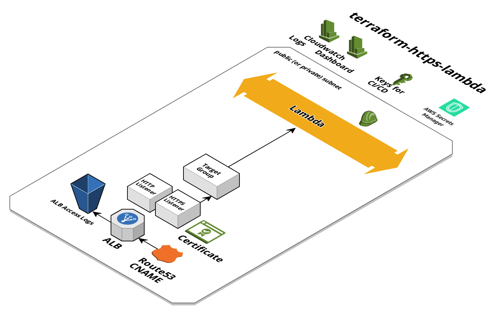

# terraform-https-alb-lambda

A Terraform template that provisions HTTPS applications using ALB and Lambda.

This will give you a running endpoint in the following format:
```bash
https://${environment}.${app}.${domain}
```

Note that after `terraform apply`, you will have a "hello world" function behind an HTTPS endpoint.  The template stops at provisioning the cloud infrastructure and assumes that you will use a different tool to do code deployments.




## Components

Note that the files that are optional can simply be deleted.

| Name | Description | Optional |
|------|-------------|:----:|
| [main.tf](main.tf) | AWS provider |  |
| [lambda.tf](lambda.tf) | Lambda function |  |
| [lb.tf](lb.tf) | ALB, Target Group, S3 bucket for access logs  |  |
| [lb-http.tf](lb-http.tf) | HTTP listener, NSG rule | Yes |
| [lb-https.tf](lb-https.tf) | HTTPS listener, NSG rule | |
| [dns-cert.tf](dns-cert.tf) | Route53 entry and ACM Certificate |  |
| [nsg.tf](nsg.tf) | NSG for ALB and function |  |
| [role.tf](role.tf) | Application Role for function |  |
| [cicd.tf](cicd.tf) | IAM user that can be used by CI/CD systems to deploy code | Yes |
| [secretsmanager.tf](secretsmanager.tf) | Secret in Secrets Manager | Yes |
| [dashboard.tf](dashboard.tf) | CloudWatch dashboard: CPU, memory, and HTTP-related metrics | Yes |


## Usage

Set your variables (`terraform.tfvars`)

```HCL
app = "myapp"

environment = "dev"

domain = "turnerlabs.io"

lambda_handler = "index.handler"

lambda_runtime = "nodejs10.x"

lambda_timeout = "60"

internal = "true"

secrets_saml_users = []

region = "us-east-1"

aws_profile = "default"

saml_role = "devops"

vpc = "vpc-123"

private_subnets = "subnet-abc,subnet-123"

public_subnets = "subnet-def,subnet-456"

tags = {
  application = "myapp"
  environment = "dev"
}
```

```bash
terraform init
terraform apply
```

## Inputs

| Name | Description | Type | Default | Required |
|------|-------------|:----:|:-----:|:-----:|
| app | The application's name | string | - | yes |
| aws_profile | The AWS Profile to use | string | - | yes |
| domain | The domain to use for the cert ($environment.$app.$domain) | string | - | yes |
| environment | The environment that is being built | string | - | yes |
| https_port | The port to listen on for HTTPS, always use 443 | string | `443` | no |
| internal | Whether the application is available on the public internet, also will determine which subnets will be used (public or private) | string | `true` | no |
| lambda_handler | The lambda handler | string | `index.handler` | no |
| lambda_runtime | The lambda runtime | string | `nodejs10.x` | no |
| lambda_timeout | The lambda timeout | string | `60` | no |
| lb_access_logs_expiration_days |  | string | `3` | no |
| lb_port | The port the load balancer will listen on | string | `80` | no |
| lb_protocol | The load balancer protocol | string | `HTTP` | no |
| private_subnets | The private subnets, minimum of 2, that are a part of the VPC(s) | string | - | yes |
| public_subnets | The public subnets, minimum of 2, that are a part of the VPC(s) | string | - | yes |
| region | The AWS region to use for the dev environment's infrastructure. | string | `us-east-1` | no |
| saml_role | The SAML role to use for adding users to the ECR policy | string | - | yes |
| secrets_saml_users | The users (email addresses) from the saml role to give access | list | - | yes |
| tags | Tags for the infrastructure | map | - | yes |
| vpc | The VPC to use for the Fargate cluster | string | - | yes |

## Outputs

| Name | Description |
|------|-------------|
| endpoint | The https endpoint that gets provisioned |


## Updating readme docs

```bash
terraform-docs md .
```